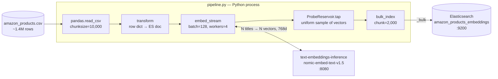
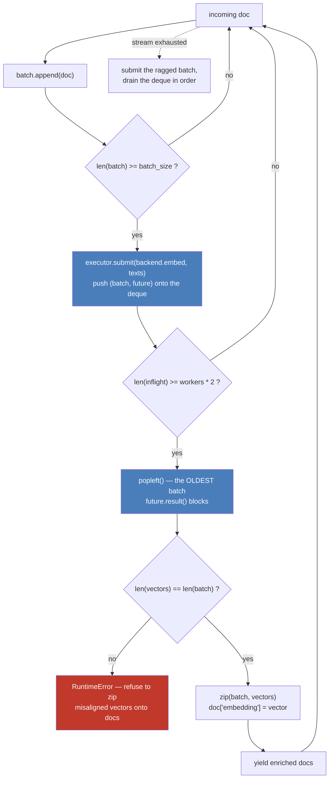
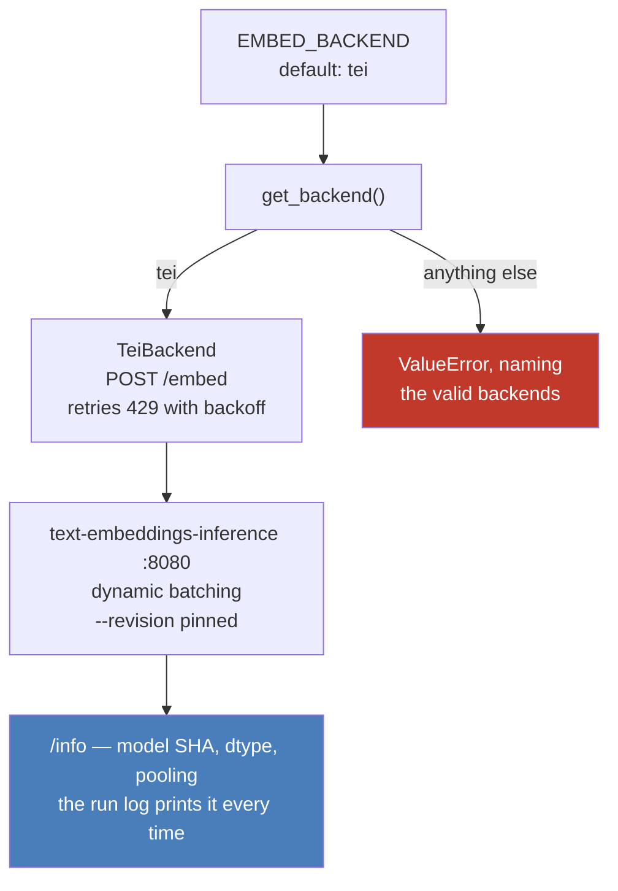
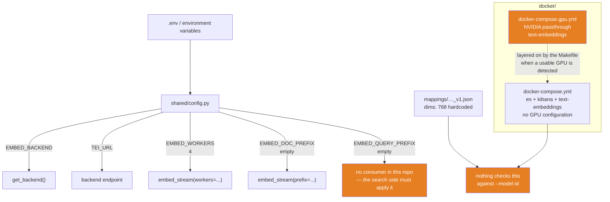
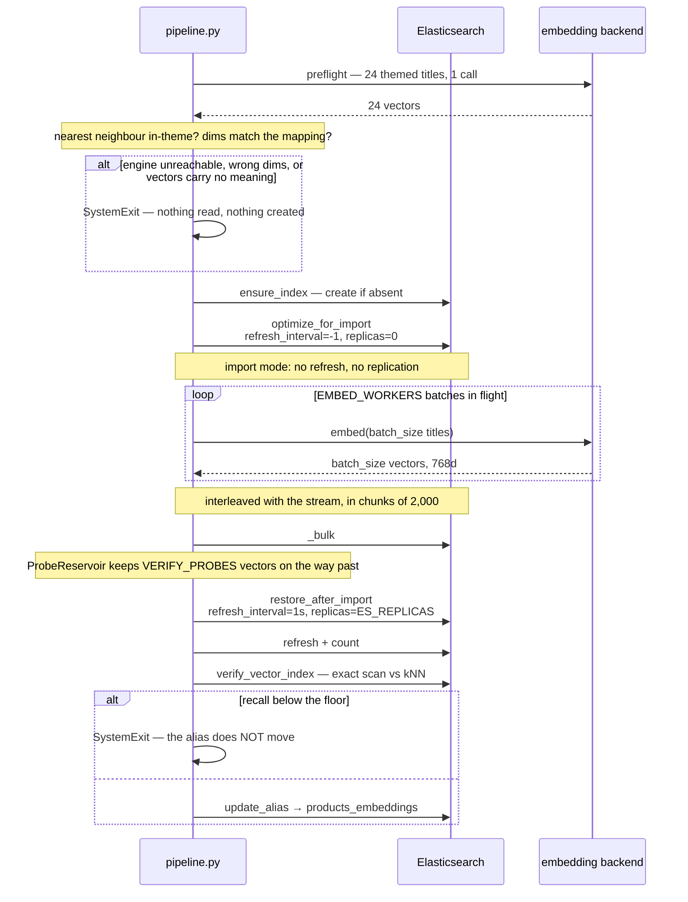
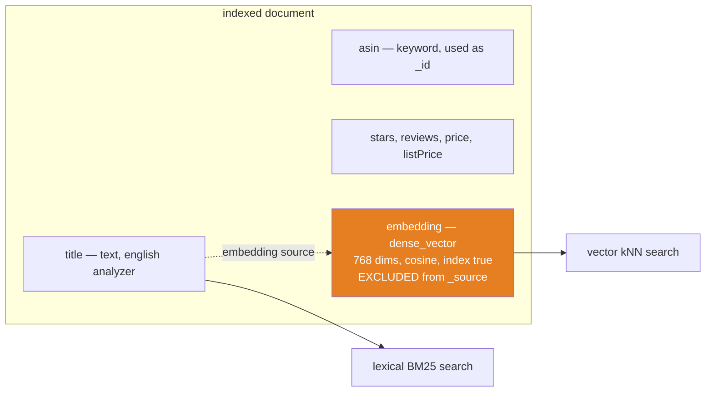

# Architecture — vector ingestion pipeline

## 1. Overview

A chain of Python generators with no intermediate materialization: the 1.4M-row CSV never
sits in memory. Each stage pulls from the previous one on demand — except the embedding
stage, which runs a small pool underneath so the GPU and Elasticsearch stop waiting on each
other.

## 2. The embedding stage in detail

`embeddings/stream.py` — the main thread reads documents and hands batches of *text* to a
pool; it never lets a worker touch the generator or the documents. Two invariants make that
safe to drop into an ingestion pipeline.

**Order is preserved.** Batches complete out of order — that is the point of the pool — but
they are *consumed* in submission order, oldest first. A document leaves the stage at the
same position it entered.

**Memory is bounded.** `popleft()` only happens once the window is full, so the upstream
generator stalls instead of reading ahead: at most `workers * 2` batches are in flight plus
the one being assembled, whatever the worker count.

`future.result()` re-raises whatever the worker raised, in the main thread, at that point in
the stream — a backend failure stops the run rather than quietly leaving a hole in the index.
The `len(vectors) != len(batch)` check is the same guardrail as before: raise instead of
attaching the wrong vector to the wrong product.

## 3. Backends

`embeddings/backends/` — both expose `embed(texts) -> vectors`, chosen by `EMBED_BACKEND`.

TEI is built for this one job: dynamic server-side batching, no generation-sized context to
pad 28-token titles into. The pipeline ran on Ollama first and moved off it. The two
produced vectors at a mean cosine of 0.51 on the same model and the same titles, which
looked at first like two implementations disagreeing. It was not. Ollama was producing
vectors with **no semantic content at all** — nearest neighbour inside a theme 11 % of the
time, worse than chance, and intra-theme similarity *below* inter-theme (−0.0083 against
TEI's +0.2652). It returned 5 distinct vectors for 9 distinct texts.

A 1.4M-document index was built and served on those vectors, and every check in this
project was green while it happened. That is what `embeddings/preflight.py` exists to make
impossible, and it is a different question from the one `shared/es/verify.py` asks.

The seam is kept for a single backend because swapping engines is not a neutral operation:
an index built with one engine and queried with another returns plausible nonsense,
silently.

## 4. Configuration and infrastructure

The mapping's `dims: 768` and the container's `--model-id` are two independent sources of
truth, and nothing reconciles them: switching embedding model without updating the JSON
fails indexing (`dynamic: strict` plus a dimension mismatch). At least that one fails
loudly, unlike swapping the engine underneath an existing index.

The GPU passthrough is a **separate compose file**, not part of the base stack. Whether it
gets layered on is decided at `make start` time, and nothing downstream reports the outcome:
a CPU-only run indexes exactly the same documents, only far slower. That makes it a silent
failure mode worth checking explicitly — see
[GPU acceleration](../README.md#gpu-acceleration).

## 5. Lifecycle of a full run

The two gates bracket the run and ask different questions. The pre-flight asks *does this
engine produce meaningful vectors* — cheap, and worthless after the fact. The recall gate
asks *does this graph retrieve them* — expensive, and meaningless before the index exists.
Either one alone would have missed the failure the other catches.

No force merge: `VECTOR_MAX_SEGMENTS` is `None`, for the reasons in
[the README](README.md#recall--is-the-index-actually-searchable) — at the cost of 9 GB of
`_recovery_source` that never gets purged, which is
[an open question](README.md#it-does-not-save-anything-yet--_recovery_source).

`--dry-run` short-circuits everything touching Elasticsearch: it transforms, embeds, and
logs the vector length plus the first 5 dimensions of the first document. That is the
validation to run before committing to 1.4M rows.

## 6. The resulting document

The title is used twice: indexed as `text` for BM25, and vectorized for kNN. Only the title
is embedded — `embed_stream` takes a configurable `text_field`, but the pipeline uses the
default.

The vector is searchable but **not retrievable**: `_source` excludes it, which divides
storage by ~3. The consequences are real and listed in
[the README](README.md#the-vector-is-not-in-_source).

## 7. Known limits

```mermaid
flowchart TD
    L0["an index is bound to the engine<br/>and revision that built it"] --> I0["swapping either under a live index<br/>fails silently — measured at 0.51 cosine"]
    L1["TEI counts one permit per INPUT"] --> I1["--max-concurrent-requests must cover<br/>workers x 2 x embed-batch, or 429"]
    L2["No checkpoint; only 429 is retried"] --> I2["any other backend error kills the run<br/>→ no resume, restart from scratch"]
    L3["dims duplicated across mapping and --model-id"] --> I3["divergence when switching model<br/>— this one at least fails loudly"]
    L4["GPU passthrough is opt-in at startup"] --> I4["a CPU-only run is ~6× slower<br/>and reports nothing"]
    L5["EMBED_QUERY_PREFIX has no consumer here"] --> I5["enabling prefixes only does half the job<br/>the search side must match"]
    L6["--recreate re-embeds all 1.4M titles"] --> I6["iterating on the mapping costs a full<br/>embedding run → an embedding cache would fix it"]
    L7["TEI pinned to a July 2025 model revision"] --> I7["upstream main does not parse under TEI<br/>→ revisit the pin, do not assume it is stale"]
    L8["_recovery_source is never purged"] --> I8["9 GB of 15 GB — the _source exclusion<br/>saves nothing until a merge runs"]

    style L0 fill:#c0392b,color:#fff
    style L1 fill:#e67e22,color:#fff
    style L2 fill:#e67e22,color:#fff
    style L3 fill:#e67e22,color:#fff
    style L4 fill:#e67e22,color:#fff
    style L5 fill:#c0392b,color:#fff
    style L6 fill:#e67e22,color:#fff
    style L7 fill:#e67e22,color:#fff
    style L8 fill:#e67e22,color:#fff
```

**On L0 —** the one that costs the most when you get it wrong, because getting it wrong
produces no symptom at all. Measured, not theoretical: the previous engine produced vectors
whose nearest neighbour landed in the right theme 11 % of the time, and a full index was
built and served on them without a single check going red.
See [the README](README.md#why-the-engine-is-not-interchangeable).

**On L1 —** the single-thread stall that used to cap the pipeline at ~500 docs/s is gone:
`embed_stream` now keeps `EMBED_WORKERS` requests in flight, so CSV parsing and the bulk call
overlap with the GPU instead of blocking it. What remains is a server-side limit. TEI rejects
with `429 Model is overloaded`, and its `--max-concurrent-requests` counts **one permit per
input**: at the default 512 a single batch of 512 titles fills the queue and every concurrent
batch bounces. It has to cover `workers × 2 × embed_batch`, hence the 8 192 in the compose
file. `TeiBackend` retries a 429 with backoff on top of that.

**On L5 —** this is the one that fails silently and expensively. Setting `EMBED_DOC_PREFIX`
without applying `EMBED_QUERY_PREFIX` at query time produces an index that still answers,
still ranks, and is measurably worse: cos(prefixed, bare) = 0.684 on this dataset. Nothing
raises.
