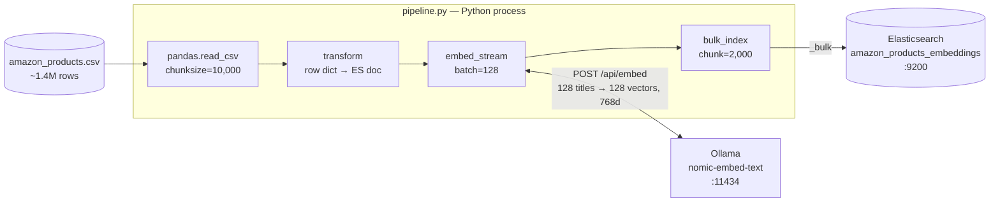
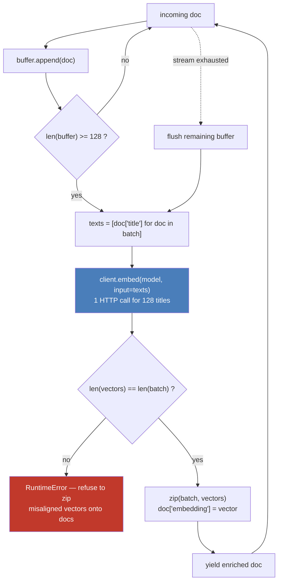
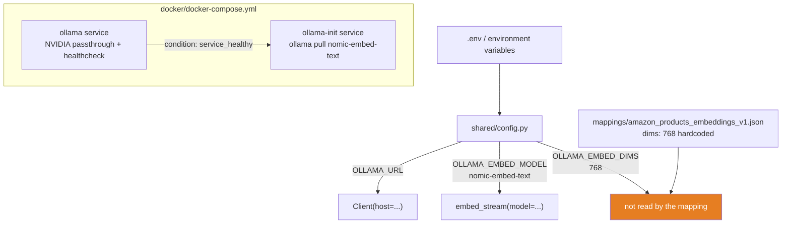
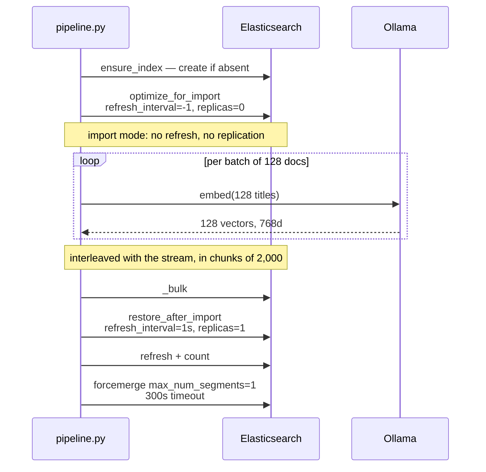
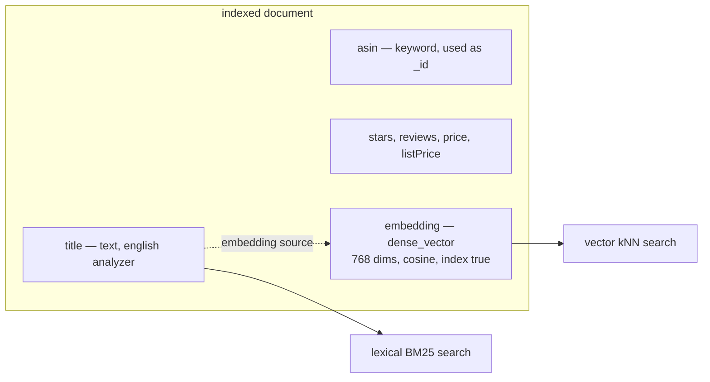
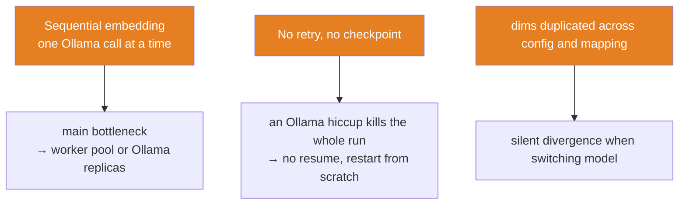

# Architecture — vector ingestion pipeline

## 1. Overview

A single chain of Python generators, with no intermediate materialization: the 1.4M-row
CSV never sits in memory. Each stage pulls from the previous one on demand.

## 2. The embedding stage in detail

`embeddings/ollama.py` — a generator that **buffers**, calls Ollama **once per batch**,
then zips the vectors back onto the documents.

**Why batching is the whole point**: `client.embed` takes a *list* of strings and returns
a list of vectors **in the same order**. That ordering guarantee is what makes the `zip`
valid. One call per document would mean one HTTP round-trip per document — batching 128
amortizes the network latency and gives the GPU a real workload.

The `len(vectors) != len(batch)` check is the guardrail: if the ordering/cardinality
assumption is ever violated, we raise instead of silently attaching the wrong vector to
the wrong product.

## 3. Configuration and infrastructure

The mapping's `dims: 768` and `OLLAMA_EMBED_DIMS` are two independent sources of truth:
switching embedding model without updating the JSON fails indexing (`dynamic: strict`
plus a dimension mismatch).

## 4. Lifecycle of a full run

`--dry-run` short-circuits everything touching Elasticsearch: it transforms, embeds, and
logs the vector length plus the first 5 dimensions of the first document. That is the
validation to run before committing to 1.4M rows.

## 5. The resulting document

The title is used twice: indexed as `text` for BM25, and vectorized for kNN. Only the
title is embedded — `embed_stream` takes a configurable `text_field`, but the pipeline
uses the default.

## 6. Known limits

