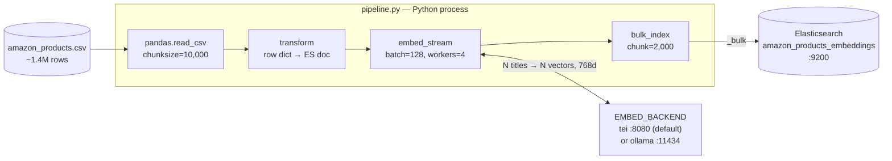
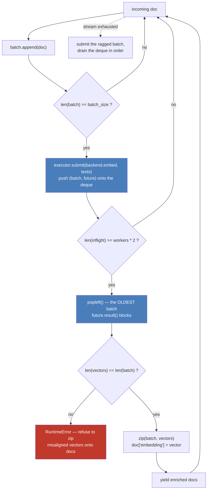

# Article 02 — Vector Ingestion

Enriches the article-01 pipeline with vector embeddings: same Kaggle **Amazon Products Dataset 2023**, same Elasticsearch instance, but each document gets a 768-dim `dense_vector` generated at ingestion time by `nomic-embed-text-v1.5`, served by [text-embeddings-inference](https://github.com/huggingface/text-embeddings-inference). [Ollama](https://ollama.com) is still wired in as an opt-in — see [The embedding backend](#the-embedding-backend) for why it is no longer the default.

**Dataset:** [Amazon Products Dataset 2023 (1.4M products)](https://www.kaggle.com/datasets/asaniczka/amazon-products-dataset-2023-1-4m-products) — download `amazon_products.csv` and place it in `article-02-vector-ingestion/data/`.

**Target index:** `amazon_products_embeddings`

## Architecture

A chain of Python generators — the 1.4M-row CSV never sits in memory. Each stage pulls from the previous one on demand, with embeddings computed client-side (no ES inference pipeline).



The embedding stage is the only one that is not a plain generator: it keeps several requests in flight so the GPU and Elasticsearch stop waiting on each other. The main thread reads documents and submits batches of *text* — workers never touch the generator or the documents.



Both backends return vectors **in input order** — that guarantee is what makes the `zip` valid, and the cardinality check is the guardrail against silently attaching the wrong vector to the wrong product. Two more invariants come from the pool itself:

- **Order survives.** Batches finish out of order, but they are consumed oldest-first, so a document leaves the stage where it entered.
- **Memory stays bounded.** The upstream generator stalls once `workers * 2` batches are in flight, so the CSV is never read ahead of the window — whatever the worker count.

A batch that raises re-raises in the main thread at that point in the stream. The run stops; it does not leave a hole in the index.

See [ARCHITECTURE.md](ARCHITECTURE.md) for the full picture: configuration wiring, run lifecycle, resulting document shape, and known limits.

## Run

From the repo root, with the docker stack up (`make up`):

```bash
# Dry run (transform + embed, no indexing) — validates backend connectivity
python article-02-vector-ingestion/pipeline.py --dry-run --limit 1000

# Limited ingestion (recommended for the article — 100k docs)
python article-02-vector-ingestion/pipeline.py --limit 100000

# Full ingestion (1.4M docs — long, GPU strongly recommended)
python article-02-vector-ingestion/pipeline.py

# Tune embedding batch size (default: 128) and concurrency (default: 4)
python article-02-vector-ingestion/pipeline.py --limit 100000 --embed-batch 512 --workers 8

# Rebuild from scratch into a fresh versioned index, then swap the alias
python article-02-vector-ingestion/pipeline.py --limit 100000 --recreate
```

Or through the Makefile, from the repo root:

```bash
make dry-run                     # 1000 docs, transform + embed, no indexing
make ingest                      # full 1.4M dataset into a fresh versioned index
make ingest LIMIT=100000         # subset
make ingest EMBED_BATCH=512      # larger embedding batches
make ingest WORKERS=8            # more requests in flight
make ingest BACKEND=ollama       # historical engine (needs make start OLLAMA=1)
make ingest INCREMENTAL=1        # rewrite the live index instead of building a new one
```

`make ingest` defaults to `--recreate` and to the **full** dataset — `LIMIT` is the opt-in.

## Index versioning

Documents are keyed by ASIN (`_id`), so a normal run **overwrites in place** rather than
appending — re-running never duplicates, it refreshes.

`--recreate` builds a new `amazon_products_embeddings_v<n>_<YYYYMMDD-HHMM>` instead (UTC
timestamp, so sorting index names by name sorts them chronologically), leaving the index
currently in service untouched and queryable for the whole run. Only once the new index is
complete, refreshed and merged does the alias move onto it, in a single atomic call:

```bash
curl -s 'localhost:9200/_cat/aliases/products_embeddings?v'   # which index is live
curl -s 'localhost:9200/products_embeddings/_count'           # always query the alias

# every build, oldest first
curl -s 'localhost:9200/_cat/indices/amazon_products_embeddings*?v&s=index&h=index,docs.count,store.size'
```

The previous index is kept on disk — the run logs the exact call to roll back onto it, or to
delete it once you're satisfied. Query `products_embeddings`, never a versioned name.

## Verifying an index

The pipeline now runs these checks itself before moving the alias — see [the gate](#the-gate).
What follows is how to run them by hand against an index that already exists.

A run that died midway leaves an index that *looks* populated, and `docs.count` alone will
not tell you. Three checks, cheapest first.

**Coverage** — every document must carry a vector, so the two counts have to match:

```bash
IDX=localhost:9200/amazon_products_embeddings

curl -s "$IDX/_count"
curl -s "$IDX/_count" -H 'Content-Type: application/json' \
  -d '{"query":{"exists":{"field":"embedding"}}}'
```

The expected total is the number of CSV rows *minus* the rows `transform` drops for having
no ASIN or no title. Beware that pandas reads `NULL`, `NA`, `None` and friends as `NaN`, so a
product whose title is literally the string `NULL` is dropped — the full dataset yields
1 426 336 documents out of 1 426 337 rows for exactly that reason.

A high `docs.deleted` is **not** a defect: `_id` is the ASIN, so re-running overwrites in
place and leaves tombstones behind. Lucene's background merges reclaim them over time.

**Authenticity** — presence is not correctness. Since the vector is excluded from `_source`
you cannot read it back and compare it, so the check runs *through search* instead: embed a
stored title, kNN with it, and the document itself must come back first with a score at 1.0
to within float noise.

```python
title = client.get(index=IDX, id=asin)["_source"]["title"]
vector = backend.embed([title])[0]
hit = client.search(index=IDX, knn={"field": "embedding", "query_vector": vector,
                                    "k": 1, "num_candidates": 100})["hits"]["hits"][0]
hit["_id"], hit["_score"]     # → (asin, 0.99999…)
```

A different `_id`, or a score meaningfully below 1.0, means the stored vectors were not
produced by the model you are querying with — a changed model, or a task prefix applied on
one side only.

**End to end** — a kNN query in natural language is the smoke test. `"wireless bluetooth
headphones for running"` should return running earbuds at the top, not arbitrary products.

## Structure

```
article-02-vector-ingestion/
├── data/                                       # gitignored — put amazon_products.csv here
├── mappings/
│   └── amazon_products_embeddings_v1.json      # ES mapping with dense_vector(768, cosine)
├── transforms/
│   └── product.py                              # CSV row → ES document (skips rows with no title)
├── embeddings/
│   ├── stream.py                               # concurrent, order-preserving embed stage
│   └── backends/
│       ├── __init__.py                         # get_backend() — EMBED_BACKEND resolution
│       ├── ollama.py                           # POST /api/embed
│       └── tei.py                              # POST /embed
└── pipeline.py                                 # main entry point
```

Shared with the rest of the repo: `shared/es/verify.py` (the recall gate and the probe
sampler) and `tools/compare_embeddings.py` (backend comparison).

## What the pipeline does

1. Creates the index from `mappings/amazon_products_embeddings_v1.json` (skips if exists)
2. Optimizes index settings for bulk import (`refresh_interval: -1`, `replicas: 0`)
3. Reads the CSV in chunks of 10 000 rows with pandas
4. Transforms each row, skipping rows with no ASIN or no title
5. Batches titles, keeps `EMBED_WORKERS` embedding requests in flight, attaches the returned vectors as `embedding`
6. Keeps a uniform sample of vectors on the way past — the only chance to, since they are not readable afterwards
7. Bulk-indexes with `chunk_size=2000` via `streaming_bulk`
8. Restores settings (`refresh_interval: 1s`, `replicas: ES_REPLICAS`) and refreshes
9. Measures recall against an exact scan — **and refuses to publish a build that fails**
10. Points the `products_embeddings` alias at the index it just wrote

There is deliberately no force merge — see [Recall](#recall--is-the-index-actually-searchable).

## Embedding choices

- **Model:** `nomic-embed-text` — 768 dims, open-weights, runs on CPU or GPU.
- **Field:** `title` only. Short, descriptive, and the field most users would search semantically.
- **Similarity:** `cosine` — the default for normalized text embeddings.
- **Index type:** `int8_hnsw` with `m: 32`, `ef_construction: 200`. ES 9 would default to `m: 16, ef_construction: 100`, which measurably under-serves 1.4M vectors — the explicit values are worth their indexing cost, see below.
- **Task prefixes:** none. The model expects them; the index is built without. See [Task prefixes](#task-prefixes-the-trap-that-does-not-raise).

## The embedding backend

`EMBED_BACKEND` picks the engine. **TEI is the default and the one this index is built with.** Ollama is kept as an opt-in, and the section below explains why it stopped being the answer.

| | `tei` (default) | `ollama` (opt-in) |
|---|---|---|
| What it is | purpose-built embedding server | general generation engine |
| Batching | dynamic, server-side | one request at a time per slot |
| Concurrency ceiling | `--max-concurrent-requests` | `OLLAMA_NUM_PARALLEL` |
| Padding | tokenizer-length batches | 28-token titles into a large context |
| Pipeline | reported by `/info`: mean pooling, dtype, revision | GGUF conversion, not introspectable |
| Started by | `make start` | `make start OLLAMA=1` |

```bash
make start                       # ES + Kibana + text-embeddings
docker logs -f search-lab-tei    # wait for "Ready" — first start downloads the model
make ingest EMBED_BATCH=512
```

### They do not produce the same vectors

Measured with `make compare`, 1 000 titles spread across the catalogue, both engines serving what is nominally `nomic-embed-text-v1.5`:

```
  mean    0.5095        min  0.3469        p50  0.5002        max  0.9402
  > 0.999      0        0.99–0.999   0     0.95–0.99   0      <= 0.95   1000
```

Not one pair above 0.95. This is **not** the signature of a task prefix — that one sits at 0.684 and is why the reading grid below names it explicitly. Two engines that claim the same model are producing measurably different embeddings, and the cause has not been established.

TEI is the one kept, for a reason that is about verifiability rather than a benchmark: it implements the sentence-transformers reference pipeline (transformer → mean pooling → L2 normalize) and its `/info` reports exactly which model SHA, dtype and pooling it is running. Ollama's GGUF conversion reports none of that, and `ollama show` cannot even distinguish nomic v1 from v1.5 — both are 137M parameters. When two things disagree, keep the one that can tell you what it did.

**What this means in practice.** Nothing errors. TEI produces perfectly valid 768-float unit vectors, Elasticsearch indexes them, the HNSW graph builds, kNN answers, and the recall gate passes. An embedding only means something relative to other vectors from the same model — so an index built with one engine and *queried* with the other returns ten plausible-looking products that have nothing to do with the query. No exception, no warning, no counter out of place. Same failure mode as the task prefixes below.

The recall gate does not protect you here either: it probes with vectors drawn from the index itself, so it is measuring inside a single space by construction. It proves the graph retrieves what it was given, not that what it was given means what you think.

### The image tag and the pinned revision

`120-1.9.3` is the Blackwell / compute-capability-12.0 build for an RTX 50X0. `latest` targets Ampere 8.0 and `89-*` targets Ada — neither starts on sm_120. HuggingFace marks the 12.0 variant experimental.

**The model revision is pinned, and has to be.** `main` of `nomic-ai/nomic-embed-text-v1.5` does not start under TEI:

```
Error: Failed to parse `config.json`
Caused by: duplicate field `max_position_embeddings` at line 42 column 15
```

The upstream commit *v5 Transformers* (2026-04-07) added `max_position_embeddings` to a `config.json` that already declared `n_positions`. TEI aliases the two onto the same field, so serde sees a duplicate and the parse fails before a single weight is loaded. The compose file pins `e5cf08aa`, the last commit before that change — same weights, `1_Pooling/config.json` still says `pooling_mode_mean_tokens: true`. Drop the pin once upstream fixes the config, not before, and confirm with `curl -s localhost:8080/info` that `model_sha` is what you asked for.

### Comparing the two, if you ever need to

```bash
make start OLLAMA=1              # brings the historical engine back up
make compare LIMIT=1000
```

`tools/compare_embeddings.py` embeds the same titles through both and reports the cosine distribution. Reading the mean:

| mean cosine | reading |
|---|---|
| > 0.999 | same model, same convention — interchangeable |
| ~ 0.99 | kernel and dtype differences, benign |
| ~ 0.68 | a task prefix applied on **one side only** — measured signature on this dataset |
| ~ 0.51 | what these two actually give. Different weights or a different pipeline; cause not established |
| < 0.95 otherwise | investigate. Do not rebuild an index on the assumption it is noise |

## Task prefixes: the trap that does not raise

`nomic-embed-text-v1.5` is trained with `search_document: ` at indexing time and `search_query: ` at query time. **This index is built without either**, and `EMBED_DOC_PREFIX` / `EMBED_QUERY_PREFIX` are empty by default so that stays true.

The gap is not cosmetic. Measured on this dataset:

```
cos(title, "search_document: " + title) = 0.684
cos(title, "search_query: "    + title) = 0.952
```

Turning the prefixes on commits you to two things at once: **rebuilding the index** with `EMBED_DOC_PREFIX`, and **applying `EMBED_QUERY_PREFIX` on every query**. Doing one without the other produces an index that still answers, still ranks, and is quietly worse — nothing raises, no count is off, no log line changes. `EMBED_QUERY_PREFIX` has no consumer in this repo, because there is no search side here yet; it is declared so the pairing is documented, and `make compare` prints what a mismatch costs.

## The vector is not in `_source`

The mapping carries `"_source": {"excludes": ["embedding"]}`. `_source` was 10.7 KB per document, ~8 KB of it the vector serialized as JSON text; dropping it divides storage by roughly 3 and takes the same weight off every background merge.

What it costs, and it is not nothing:

- **No `_reindex` without re-embedding.** Rebuilding the index means running the pipeline again from the CSV. That is what `--recreate` does anyway, so it is a real constraint rather than a lost habit.
- **The vector does not come back in hits.** Any "more like this document" flow needs the query vector from somewhere else.
- **The recall gate cannot sample its own probes.** `verify_vector_index` used to read probe vectors out of `_source`; with the exclusion in place that returns nothing, and the gate would fail every single run. `ProbeReservoir` taps the ingestion stream and keeps a uniform sample as the documents go past — reservoir sampling, not the first N, because the CSV is sorted by category and a head slice is one narrow corner of the catalogue.

Removing the exclusion re-enables everything above and puts ~11 GB back on disk for the full dataset.

## Recall — is the index actually searchable?

Counting documents proves nothing about search. An index can hold every document, each with a valid 768-float unit vector, and still fail to return them: the kNN query walks an HNSW graph, and how well that graph was built is invisible to `docs.count`. So the pipeline measures it, and the numbers below are what the settings are chosen from.

### Measuring it honestly

Recall is measured against an exact brute-force scan of the same index. The subtlety is **which queries** you probe with. Hand-written text queries are a trap here: on this dataset, a query like `"wireless bluetooth headphones for running"` has its ranks 2–10 sitting within 0.04 cosine of each other, so thousands of the 1.4M documents are effectively tied. Recall@10 then measures which of the near-ties the ANN happened to pick, not whether it works — and it swings wildly for reasons that have nothing to do with the index.

The fix is to probe with **the embedding of a document drawn from the index**. That document is its own nearest neighbour, so the neighbourhood is real and well separated. This is what `shared/es/verify.py` does, and what the table below uses.

### What actually moves the needle

100 000 documents sampled across the whole CSV (every 14th row — the file is ordered by category, so a head slice covers 15 categories instead of 246). Recall@10 over 30 probes, against exact search:

| index_options | force merge | segments | ef=100 | ef=100 +oversample 4 | ef=500 +oversample 4 |
|---|---|---|---|---|---|
| ES 9 defaults | no | 4 | 85 % | 92 % | 95 % |
| ES 9 defaults | to 1/shard | 2 | 82 % | 87 % | 93 % |
| **m=32, ef_c=200** | **no** | 4 | **92 %** | **100 %** | **100 %** |
| m=32, ef_c=200 | to 1/shard | 2 | 87 % | 97 % | 100 % |

Three findings, in order of value:

- **`rescore_vector` costs nothing and buys the most.** Oversampling retrieves extra candidates on the quantized vectors then rescores them at full precision. It is a *query-time* option — no rebuild, no reindex — and it is worth +7 to +8 points:
  ```json
  { "knn": { "field": "embedding", "query_vector": [...], "k": 10,
             "num_candidates": 500, "rescore_vector": { "oversample": 4 } } }
  ```
- **Raising `m` and `ef_construction` is worth ~7 points** for about 16 % more indexing time. Hence the explicit `index_options` in the mapping.
- **Force merging to one segment costs ~5 points.** Each segment carries its own HNSW graph and Elasticsearch searches every one of them with the full `num_candidates` budget, so collapsing to a single segment shrinks the exploration a query gets. It also costs 25 s and buys nothing this index needs, so `VECTOR_MAX_SEGMENTS` in `pipeline.py` is `None`. If you ever re-enable it, target several segments per shard — never 1.

### The gate

`verify_vector_index` runs after the build and before the alias moves. It checks coverage, then probes recall, and a build that falls under the floor **does not get published**: the alias keeps serving the previous index and the run exits non-zero. Roughly 35 s per probe on 1.4M documents, five probes by default.

The floor is set at 40 %, deliberately a bar for *broken* rather than a target for *good*. Repeated runs against the 1.4M index land anywhere between 63 % and 90 % depending on which documents get drawn — five probes is a coarse instrument, and that spread is the reason the floor sits well below the observed range. Treat a passing gate as "the graph retrieves", never as "the recall is tuned"; use the table above for that.

## Performance notes

The embedding stage is the bottleneck — one call per document over 1.4M items would run for hours. Three levers matter, and they are not worth the same.

### Where the model runs, and how big the batches are

Measured on an RTX 5060 Ti (16 GB) with `--dry-run`, **on the single-threaded pipeline and on Ollama** — that is, the configuration this article started from. The numbers isolate transform + embed with no bulk indexing in the way, and they are the baseline everything below is measured against:

| Setup | Throughput | Extrapolated to 1.4M |
|-------|-----------|----------------------|
| CPU only | 87 docs/s | ~4 h 30 |
| GPU, `--embed-batch 128` (default) | 321 docs/s | ~74 min |
| **GPU, `--embed-batch 512`** | **504 docs/s** | **~47 min** |
| GPU, `--embed-batch 1024` | 507 docs/s | plateau |
| GPU, `--embed-batch 2048` | 505 docs/s | plateau |

Moving the model onto the GPU buys ~3.7×; raising the batch on top of that buys another ~1.6×. Both are cheap — neither touches the pipeline code:

```bash
make ingest EMBED_BATCH=512
```

Getting the GPU is the part that fails quietly: a CPU-only run produces exactly the same index, just hours later. See [GPU acceleration](../README.md#gpu-acceleration) for how the stack enables it and, more importantly, how to verify it actually happened.

### Why it stopped at ~500 docs/s

Throughput plateaued from batch 512 onward while the GPU sat at **51 % average utilization** (59 % peak) drawing **70 W of a 180 W budget** and holding **697 MB of 16 GB**. The model is small — 261 MiB of weights — so there was nothing left to saturate by enlarging batches further. At 400 docs/s the card was doing roughly 3 TFLOPS of the ~180 it can sustain in FP16: about 2 % of it.

The idle half was structural rather than a tuning problem. The pipeline was a single thread doing read → transform → HTTP → bulk in sequence, so the GPU waited while pandas parsed CSV and while Elasticsearch took the bulk, and vice versa. Where the time went, per stage, on a ~60 min reference run:

| Stage | Measured throughput | Share of a full run |
|---|---|---|
| CSV + transform | 186 761 docs/s | 0.2 % |
| Bulk into ES (serialization included) | 3 436 docs/s | 12 % |
| Embedding | ~450 docs/s | **88 %** |

### Overlapping the stages

`embed_stream` now keeps `EMBED_WORKERS` requests in flight (default 4), so the seven minutes of bulk indexing come off the critical path and the CSV is parsed while the GPU works. Order and memory are preserved — see [Architecture](#architecture).

That alone is bounded by what the server will accept, and the two engines refuse differently — which is worth knowing before you turn `WORKERS` up:

- **Ollama** answers `OLLAMA_NUM_PARALLEL` requests at a time and silently *queues* the rest. Nothing fails; the extra workers simply wait. The compose file sets it to 4 to match `EMBED_WORKERS`.
- **TEI** answers `429 Model is overloaded` the instant its queue is full, and `--max-concurrent-requests` counts **one permit per input, not per request**. At the default 512, a single batch of 512 titles fills it and every concurrent batch bounces. It has to cover `--workers × 2 × --embed-batch` — 4 096 at the defaults, hence the 8 192 in the compose file. `TeiBackend` also retries a 429 with backoff, so a transient burst costs a few hundred milliseconds instead of a 47-minute run.

Past that, the ceiling moves off the GPU entirely: at 3 436 docs/s the bulk stage becomes the limit, which is ~7 min for the full dataset.

**Not yet measured.** The throughput table above is the single-threaded Ollama baseline. Re-run `make dry-run` and a full `make ingest EMBED_BATCH=512` to put real figures against the concurrent pipeline on TEI — nothing in this section beyond the baseline table has been benchmarked.

### Subset

For the article, 100k docs (`make ingest LIMIT=100000`) is enough to demonstrate hybrid search downstream without committing to a full run.
