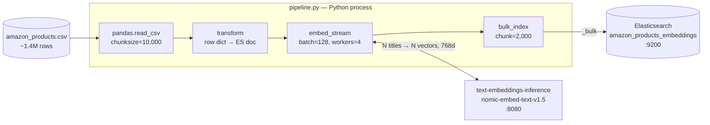
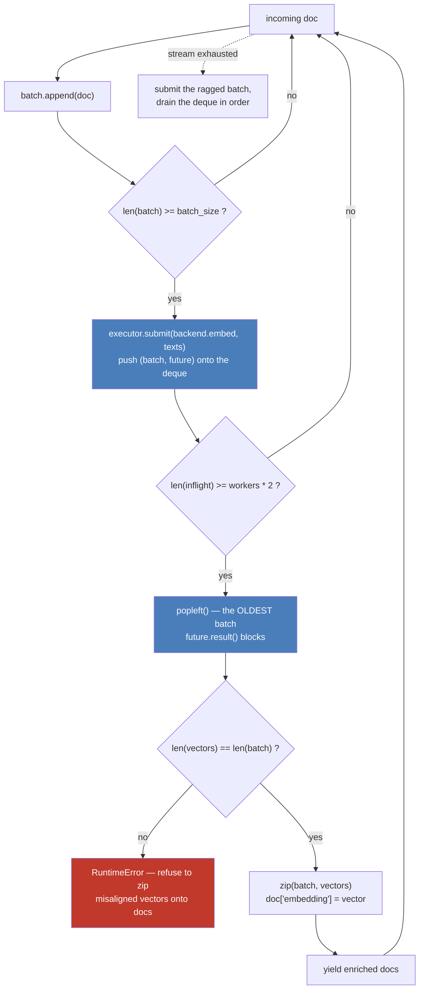

# Article 02 — Vector Ingestion

Enriches the article-01 pipeline with vector embeddings: same Kaggle **Amazon Products Dataset 2023**, same Elasticsearch instance, but each document gets a 768-dim `dense_vector` generated at ingestion time by `nomic-embed-text-v1.5`, served by [text-embeddings-inference](https://github.com/huggingface/text-embeddings-inference).

**Dataset:** [Amazon Products Dataset 2023 (1.4M products)](https://www.kaggle.com/datasets/asaniczka/amazon-products-dataset-2023-1-4m-products) — download `amazon_products.csv` and place it in `article-02-vector-ingestion/data/`.

**Target index:** `amazon_products_embeddings`

## Architecture

A chain of Python generators — the 1.4M-row CSV never sits in memory. Each stage pulls from the previous one on demand, with embeddings computed client-side (no ES inference pipeline).



The embedding stage is the only one that is not a plain generator: it keeps several requests in flight so the GPU and Elasticsearch stop waiting on each other. The main thread reads documents and submits batches of *text* — workers never touch the generator or the documents.



Both backends return vectors **in input order** — that guarantee is what makes the `zip` valid, and the cardinality check is the guardrail against silently attaching the wrong vector to the wrong product. Two more invariants come from the pool itself:

- **Order survives.** Batches finish out of order, but they are consumed oldest-first, so a document leaves the stage where it entered.
- **Memory stays bounded.** The upstream generator stalls once `workers * 2` batches are in flight, so the CSV is never read ahead of the window — whatever the worker count.

A batch that raises re-raises in the main thread at that point in the stream. The run stops; it does not leave a hole in the index.

See [ARCHITECTURE.md](ARCHITECTURE.md) for the full picture: configuration wiring, run lifecycle, resulting document shape, and known limits.

## Run

From the repo root, with the docker stack up (`make up`):

```bash
# Dry run (transform + embed, no indexing) — validates backend connectivity
python article-02-vector-ingestion/pipeline.py --dry-run --limit 1000

# Limited ingestion (recommended for the article — 100k docs)
python article-02-vector-ingestion/pipeline.py --limit 100000

# Full ingestion (1.4M docs — long, GPU strongly recommended)
python article-02-vector-ingestion/pipeline.py

# Tune embedding batch size (default: 128) and concurrency (default: 4)
python article-02-vector-ingestion/pipeline.py --limit 100000 --embed-batch 512 --workers 8

# Rebuild from scratch into a fresh versioned index, then swap the alias
python article-02-vector-ingestion/pipeline.py --limit 100000 --recreate
```

Or through the Makefile, from the repo root:

```bash
make dry-run                     # 1000 docs, transform + embed, no indexing
make ingest                      # full 1.4M dataset into a fresh versioned index
make ingest LIMIT=100000         # subset
make ingest EMBED_BATCH=512      # larger embedding batches
make ingest WORKERS=8            # more requests in flight
make ingest INCREMENTAL=1        # rewrite the live index instead of building a new one
make ingest SKIP_CHECKS=1        # skip the pre-flight — fast iteration only
```

`make ingest` defaults to `--recreate` and to the **full** dataset — `LIMIT` is the opt-in.

## Index versioning

Documents are keyed by ASIN (`_id`), so a normal run **overwrites in place** rather than
appending — re-running never duplicates, it refreshes.

`--recreate` builds a new `amazon_products_embeddings_v<n>_<YYYYMMDD-HHMM>` instead (UTC
timestamp, so sorting index names by name sorts them chronologically), leaving the index
currently in service untouched and queryable for the whole run. Only once the new index is
complete, refreshed and merged does the alias move onto it, in a single atomic call:

```bash
curl -s 'localhost:9200/_cat/aliases/products_embeddings?v'   # which index is live
curl -s 'localhost:9200/products_embeddings/_count'           # always query the alias

# every build, oldest first
curl -s 'localhost:9200/_cat/indices/amazon_products_embeddings*?v&s=index&h=index,docs.count,store.size'
```

The previous index is kept on disk — the run logs the exact call to roll back onto it, or to
delete it once you're satisfied. Query `products_embeddings`, never a versioned name.

## Verifying an index

The pipeline now runs these checks itself before moving the alias — see [the gate](#the-gate).
What follows is how to run them by hand against an index that already exists.

A run that died midway leaves an index that *looks* populated, and `docs.count` alone will
not tell you. Three checks, cheapest first.

**Coverage** — every document must carry a vector, so the two counts have to match:

```bash
IDX=localhost:9200/amazon_products_embeddings

curl -s "$IDX/_count"
curl -s "$IDX/_count" -H 'Content-Type: application/json' \
  -d '{"query":{"exists":{"field":"embedding"}}}'
```

The expected total is the number of CSV rows *minus* the rows `transform` drops for having
no ASIN or no title. Beware that pandas reads `NULL`, `NA`, `None` and friends as `NaN`, so a
product whose title is literally the string `NULL` is dropped — the full dataset yields
1 426 336 documents out of 1 426 337 rows for exactly that reason.

A high `docs.deleted` is **not** a defect: `_id` is the ASIN, so re-running overwrites in
place and leaves tombstones behind. Lucene's background merges reclaim them over time.

**Authenticity** — presence is not correctness. Since the vector is excluded from `_source`
you cannot read it back and compare it, so the check runs *through search* instead: embed a
stored title, kNN with it, and the document itself must come back first with a score at 1.0
to within float noise.

```python
title = client.get(index=IDX, id=asin)["_source"]["title"]
vector = backend.embed([title])[0]
hit = client.search(index=IDX, knn={"field": "embedding", "query_vector": vector,
                                    "k": 1, "num_candidates": 100})["hits"]["hits"][0]
hit["_id"], hit["_score"]     # → (asin, 0.99999…)
```

A different `_id`, or a score meaningfully below 1.0, means the stored vectors were not
produced by the model you are querying with — a changed model, or a task prefix applied on
one side only.

**End to end** — a kNN query in natural language is the smoke test. `"wireless bluetooth
headphones for running"` should return running earbuds at the top, not arbitrary products.

## Structure

```
article-02-vector-ingestion/
├── data/                                       # gitignored — put amazon_products.csv here
├── mappings/
│   └── amazon_products_embeddings_v1.json      # ES mapping with dense_vector(768, cosine)
├── transforms/
│   └── product.py                              # CSV row → ES document (skips rows with no title)
├── embeddings/
│   ├── stream.py                               # concurrent, order-preserving embed stage
│   ├── preflight.py                            # semantic check of the engine, before ingesting
│   └── backends/
│       ├── __init__.py                         # get_backend() — EMBED_BACKEND resolution
│       └── tei.py                              # POST /embed, retries 429
└── pipeline.py                                 # main entry point
```

Shared with the rest of the repo: `shared/es/verify.py`, which holds the recall gate and the
probe sampler. The two gates live apart on purpose — `preflight.py` knows about embedding
engines and nothing about Elasticsearch, `verify.py` the reverse.

## What the pipeline does

1. **Pre-flight** — embeds two dozen themed titles and refuses to start if the engine is unreachable, returns the wrong dimensions, or produces vectors with no semantic content
2. Creates the index from `mappings/amazon_products_embeddings_v1.json` (skips if exists)
3. Optimizes index settings for bulk import (`refresh_interval: -1`, `replicas: 0`)
4. Reads the CSV in chunks of 10 000 rows with pandas
5. Transforms each row, skipping rows with no ASIN or no title
6. Batches titles, keeps `EMBED_WORKERS` embedding requests in flight, attaches the returned vectors as `embedding`
7. Keeps a uniform sample of vectors on the way past — the only chance to, since they are not readable afterwards
8. Bulk-indexes with `chunk_size=2000` via `streaming_bulk`
9. Restores settings (`refresh_interval: 1s`, `replicas: ES_REPLICAS`) and refreshes
10. Measures recall against an exact scan — **and refuses to publish a build that fails**
11. Points the `products_embeddings` alias at the index it just wrote

Steps 1 and 10 are the two gates, and they are not redundant: one validates the engine before any work is done, the other validates the HNSW graph before anything is published.

There is deliberately no force merge — see [Recall](#recall--is-the-index-actually-searchable), and [`_recovery_source`](#it-does-not-save-anything-yet--_recovery_source) for what that currently costs in disk.

## Embedding choices

- **Model:** `nomic-embed-text-v1.5` — 768 dims, open-weights, pinned revision.
- **Field:** `title` only. Short, descriptive, and the field most users would search semantically.
- **Similarity:** `cosine` — the default for normalized text embeddings.
- **Index type:** `int8_hnsw` with `m: 32`, `ef_construction: 200`. ES 9 would default to `m: 16, ef_construction: 100`, which measurably under-serves 1.4M vectors — the explicit values are worth their indexing cost, see below.
- **Task prefixes:** none. The model expects them; the index is built without. See [Task prefixes](#task-prefixes-the-trap-that-does-not-raise).

## The embedding backend

Embeddings come from [text-embeddings-inference](https://github.com/huggingface/text-embeddings-inference), a server built for this one job: it batches dynamically, it does not pad 28-token titles into a generation-sized context, and its `/info` states exactly which model SHA, dtype and pooling it is running.

```bash
make start                       # ES + Kibana + text-embeddings
docker logs -f search-lab-tei    # wait for "Ready" — first start downloads the model
make ingest EMBED_BATCH=512
```

`EMBED_BACKEND` selects it. There is one backend today; the seam is kept because swapping engines is not a neutral operation — see below.

### The image tag and the pinned revision

`120-1.9.3` is the Blackwell / compute-capability-12.0 build for an RTX 50X0. `latest` targets Ampere 8.0 and `89-*` targets Ada — neither starts on sm_120. HuggingFace marks the 12.0 variant experimental.

**The model revision is pinned, and has to be.** `main` of `nomic-ai/nomic-embed-text-v1.5` does not start under TEI:

```
Error: Failed to parse `config.json`
Caused by: duplicate field `max_position_embeddings` at line 42 column 15
```

The upstream commit *v5 Transformers* (2026-04-07) added `max_position_embeddings` to a `config.json` that already declared `n_positions`. TEI aliases the two onto the same field, so serde sees a duplicate and the parse fails before a single weight is loaded. The compose file pins `e5cf08aa`, the last commit before that change — same weights, `1_Pooling/config.json` still says `pooling_mode_mean_tokens: true`. Drop the pin once upstream fixes the config, not before, and confirm with `curl -s localhost:8080/info` that `model_sha` is what you asked for.

### Why the engine is not interchangeable

This pipeline ran on [Ollama](https://ollama.com) first. Both servers were pointed at the same model, `nomic-embed-text-v1.5`, and asked for the same 1 000 titles. The vectors came back at a **mean cosine of 0.51** — median 0.50, nothing above 0.95.

The first reading was "two implementations disagree, keep the verifiable one". That reading was wrong, and the correction is the most useful thing in this article. Ollama was not producing *different* embeddings. It was producing embeddings with **no semantic content at all**. Nearest neighbours computed on the vectors actually stored in the index it built:

| Title | Its nearest neighbour, according to those vectors | cosine |
|---|---|---|
| Womens Shacket … Button Down Shirts | Vintage Copper Train London **Pocket Watch** | 0.9995 |
| Womens Mens Lightweight **Sneaker** … Shoes | 12PCS Gold Chunky **Rings** for Women | 0.9754 |
| Bluetooth Car **FM Transmitter** | Flexible **3D Printer** Build Plate | 0.8019 |

Measured properly, on three themes of three obviously-related titles each:

| | intra-theme | inter-theme | separation | nearest neighbour correct |
|---|---|---|---|---|
| Ollama | 0.8013 | 0.8097 | **−0.0083** | **11 %** — worse than chance |
| TEI | 0.6254 | 0.3602 | **+0.2652** | **100 %** |

Everything about those vectors was structurally perfect. 768 floats, L2 norm 1.0000, `docs.count` correct to the document, and the recall gate passing at 90 %. It also returned only **5 distinct vectors for 9 distinct texts** — identical whether called in batches or one at a time, so not a batching bug. Spearman correlation between the two engines' similarity structures: **0.0986**, near-total independence.

A 1.4M-document index was served on that, and nothing went red.

### Why nothing caught it

`verify_vector_index` compares approximate kNN against an exact scan **over the same vectors**. If those vectors are noise, both methods retrieve the same noise and recall is excellent. It measures the quality of the HNSW graph, not the quality of the embeddings. Norms, dimensions and counts were green for the same reason: none of them look at meaning.

That hole is now closed by `embeddings/preflight.py`, which runs **before** the first CSV row is read:

```
Preflight — tei — 768d, nearest neighbour in-theme 100%, intra 0.6254 / inter 0.3602
                  (separation +0.2652) over 24 titles in 6 themes
```

It embeds two dozen product titles grouped into six disjoint themes and checks that each title's nearest neighbour stays inside its own theme. One embedding call, about two seconds — because finding out the engine is broken must not cost nine minutes of embedding followed by a gate at the end. It also catches an unreachable backend, a dimension mismatch against the mapping, and an engine collapsing distinct inputs onto the same vector.

The floors are 80 % in-theme neighbours and a separation of +0.05. Like `min_recall`, they are floors for *broken*, not targets for *good* — the two engines measured sit at 11 %/−0.008 and 100 %/+0.265, so anything in between separates them without risking a false alarm. Raising them will not improve anything; that is not what they measure.

`--skip-checks` (or `make ingest SKIP_CHECKS=1`) turns it off for fast iteration. It is not the default and should not become it.

The two gates are complementary and neither sees what the other sees: **pre-flight validates the engine, `verify_vector_index` validates the graph.**

### What this still means

An index is bound to the engine and the model revision that built it. Changing either means rebuilding, and the query side has to move at the same time. An index built with one engine and *queried* with another returns ten plausible-looking products that have nothing to do with the query — no exception, no warning, no counter out of place. Same shape of trap as the task prefixes below.

## Task prefixes: the trap that does not raise

`nomic-embed-text-v1.5` is trained with `search_document: ` at indexing time and `search_query: ` at query time. **This index is built without either**, and `EMBED_DOC_PREFIX` / `EMBED_QUERY_PREFIX` are empty by default so that stays true.

The gap is not cosmetic. Measured on this dataset:

```
cos(title, "search_document: " + title) = 0.684
cos(title, "search_query: "    + title) = 0.952
```

Turning the prefixes on commits you to two things at once: **rebuilding the index** with `EMBED_DOC_PREFIX`, and **applying `EMBED_QUERY_PREFIX` on every query**. Doing one without the other produces an index that still answers, still ranks, and is quietly worse — nothing raises, no count is off, no log line changes. `EMBED_QUERY_PREFIX` has no consumer in this repo, because there is no search side here yet; it is declared so that the pairing is documented rather than discovered later.

## The vector is not in `_source`

The mapping carries `"_source": {"excludes": ["embedding"]}`. `_source` was 10.7 KB per document, ~8 KB of it the vector serialized as JSON text.

What it costs, and it is not nothing:

- **No `_reindex` without re-embedding.** Rebuilding the index means running the pipeline again from the CSV. That is what `--recreate` does anyway, so it is a real constraint rather than a lost habit.
- **The vector does not come back in hits** — see [Reading a stored vector](#reading-a-stored-vector) for the one way that still works.
- **The recall gate cannot sample its own probes.** `verify_vector_index` used to read probe vectors out of `_source`; with the exclusion in place that returns nothing, and the gate would fail every single run. `ProbeReservoir` taps the ingestion stream and keeps a uniform sample as the documents go past — reservoir sampling, not the first N, because the CSV is sorted by category and a head slice is one narrow corner of the catalogue.

### It does not save anything yet — `_recovery_source`

This is the non-obvious part, and it was invisible until someone ran `_disk_usage` on the built index:

```
total 15.16 GB
  _recovery_source     9.05 GB   59.7%
  embedding            5.53 GB   36.5%
  _source              0.39 GB    2.6%
  title                0.06 GB    0.4%
```

The exclusion works exactly as advertised — real `_source` is down to 0.39 GB. But **as soon as `_source` is filtered, Elasticsearch stores a `_recovery_source` alongside it**: a complete copy, embedding included, kept for shard recovery. It is only dropped by a **segment merge**, and only once the `index.soft_deletes.retention_lease.period` lease (12 h by default) has expired.

This index shows **37 segments and `merges total: 0`**. No merge has ever run — the force merge was removed (see [Recall](#recall--is-the-index-actually-searchable)) and the index is quiescent after the build, so nothing triggers one.

Net result today: 15.16 GB with the exclusion, against 14.2 GB for the previous index without it. **The optimization currently costs about 1 GB instead of saving 11.** In steady state, once a merge has run, it would be ~6.1 GB — 2.3× smaller. The saving is real; it is just not reachable without a merge.

Four avenues, none of them measured yet, listed honestly:

1. **Check whether merges are genuinely never happening.** `merges total: 0` was read shortly after the run. Background merges are asynchronous; re-read `_stats/merge` some hours later before concluding. If natural merges do eventually run, the 9 GB frees itself once the lease expires and there is nothing to do.
2. **Force merge, if the recall cost has changed.** The −5 points were measured at `m: 16, ef_construction: 100`. The mapping is `m: 32, ef_construction: 200` now, and a denser graph may absorb the merge better. This needs measuring — the protocol is below.
3. **Shorten `index.soft_deletes.retention_lease.period`.** It does not trigger a merge, it only makes the lease expire sooner so that any merge which does happen purges the recovery source. Useful in combination with 1 or 2, useless alone.
4. **Drop the exclusion.** No `_source` filtering means no `_recovery_source` at all, and the index lands back at ~14.2 GB with the vector retrievable and `_reindex` possible again. Worse than a merged exclusion, better than the current state.

### Protocol for re-measuring the force merge

A full run now takes **8.9 minutes**, which makes this experiment cheap in a way it was not at 47 minutes. Build both indices rather than merging one in place, so the comparison is paired and nothing has to be un-done:

```bash
make ingest EMBED_BATCH=512                     # v_n   — leave unmerged
make ingest EMBED_BATCH=512                     # v_n+1 — merge this one
curl -X POST 'localhost:9200/<v_n+1>/_forcemerge?max_num_segments=1'
```

Then, against **both** indices with the same probe documents (same ASINs, so the comparison is paired rather than two independent samples):

- recall@10 vs an exact `script_score` scan, **30 probes minimum** — the gate's 5 are far too coarse to compare two configurations
- at `num_candidates` 100, 500 and 2000, each with and without `rescore_vector: {oversample: 4}`
- record for each: `_disk_usage` breakdown, `_recovery_source` share, segment count, and how long the merge itself took

Decide with the rule written down first, not after seeing the numbers. A defensible one: **merge if the recall loss at `num_candidates: 500` with oversample 4 stays under 2 points.** That is the configuration a real query would use, and 9 GB is worth two points there. If it costs 5 points again, as it did at `m: 16`, it is not worth it — leave `VECTOR_MAX_SEGMENTS` at `None` and take avenue 1 or 4 instead.

Nothing here is implemented. `VECTOR_MAX_SEGMENTS` is still `None`, and it should stay that way until there are numbers.

### Reading a stored vector

Since `embedding` is out of `_source`, it appears neither in Kibana Discover nor via the `fields` parameter — `fields` returns the other fields and silently omits it. `docvalue_fields` is the way:

```json
GET products_embeddings/_search
{
  "size": 1,
  "query": { "match": { "title": "headphones" } },
  "_source": ["title"],
  "docvalue_fields": ["embedding"]
}
```

Verified: returns all 768 dimensions, norm 1.0.

## Recall — is the index actually searchable?

Counting documents proves nothing about search. An index can hold every document, each with a valid 768-float unit vector, and still fail to return them: the kNN query walks an HNSW graph, and how well that graph was built is invisible to `docs.count`. So the pipeline measures it, and the numbers below are what the settings are chosen from.

### Measuring it honestly

Recall is measured against an exact brute-force scan of the same index. The subtlety is **which queries** you probe with. Hand-written text queries are a trap here: on this dataset, a query like `"wireless bluetooth headphones for running"` has its ranks 2–10 sitting within 0.04 cosine of each other, so thousands of the 1.4M documents are effectively tied. Recall@10 then measures which of the near-ties the ANN happened to pick, not whether it works — and it swings wildly for reasons that have nothing to do with the index.

The fix is to probe with **the embedding of a document drawn from the index**. That document is its own nearest neighbour, so the neighbourhood is real and well separated. This is what `shared/es/verify.py` does, and what the table below uses.

### What actually moves the needle

100 000 documents sampled across the whole CSV (every 14th row — the file is ordered by category, so a head slice covers 15 categories instead of 246). Recall@10 over 30 probes, against exact search:

| index_options | force merge | segments | ef=100 | ef=100 +oversample 4 | ef=500 +oversample 4 |
|---|---|---|---|---|---|
| ES 9 defaults | no | 4 | 85 % | 92 % | 95 % |
| ES 9 defaults | to 1/shard | 2 | 82 % | 87 % | 93 % |
| **m=32, ef_c=200** | **no** | 4 | **92 %** | **100 %** | **100 %** |
| m=32, ef_c=200 | to 1/shard | 2 | 87 % | 97 % | 100 % |

Three findings, in order of value:

- **`rescore_vector` costs nothing and buys the most.** Oversampling retrieves extra candidates on the quantized vectors then rescores them at full precision. It is a *query-time* option — no rebuild, no reindex — and it is worth +7 to +8 points:
  ```json
  { "knn": { "field": "embedding", "query_vector": [...], "k": 10,
             "num_candidates": 500, "rescore_vector": { "oversample": 4 } } }
  ```
- **Raising `m` and `ef_construction` is worth ~7 points** for about 16 % more indexing time. Hence the explicit `index_options` in the mapping.
- **Force merging to one segment costs ~5 points.** Each segment carries its own HNSW graph and Elasticsearch searches every one of them with the full `num_candidates` budget, so collapsing to a single segment shrinks the exploration a query gets. It also costs 25 s and buys nothing this index needs, so `VECTOR_MAX_SEGMENTS` in `pipeline.py` is `None`. If you ever re-enable it, target several segments per shard — never 1.

### The gate

`verify_vector_index` runs after the build and before the alias moves. It checks coverage, then probes recall, and a build that falls under the floor **does not get published**: the alias keeps serving the previous index and the run exits non-zero. Roughly 35 s per probe on 1.4M documents, five probes by default.

The floor is set at 40 %, deliberately a bar for *broken* rather than a target for *good*. Repeated runs against the 1.4M index land anywhere between 63 % and 90 % depending on which documents get drawn — five probes is a coarse instrument, and that spread is the reason the floor sits well below the observed range. Treat a passing gate as "the graph retrieves", never as "the recall is tuned"; use the table above for that.

## Performance notes

**Where it ended up:** 1 426 336 documents in **8.9 minutes**, ~2 670 docs/s, on an RTX 5060 Ti at 100 % utilization drawing 169 W of its 180 W budget. That is 5.3× the starting point, and the card is now genuinely the thing working rather than the thing waiting.

| | Throughput | Full dataset |
|---|---|---|
| Starting point — single thread, Ollama, batch 128 | 321 docs/s | ~74 min |
| Same, batch 512 | 504 docs/s | ~47 min |
| **Concurrent pipeline, TEI, batch 512** | **2 670 docs/s** | **8.9 min** |

The rest of this section is how it got there, because the order the levers were pulled in matters more than the final number.

### Where the model runs, and how big the batches are

Measured on the RTX 5060 Ti with `--dry-run`, **on the single-threaded pipeline and on Ollama** — the configuration this article started from. The numbers isolate transform + embed with no bulk indexing in the way:

| Setup | Throughput | Extrapolated to 1.4M |
|-------|-----------|----------------------|
| CPU only | 87 docs/s | ~4 h 30 |
| GPU, `--embed-batch 128` (default) | 321 docs/s | ~74 min |
| **GPU, `--embed-batch 512`** | **504 docs/s** | **~47 min** |
| GPU, `--embed-batch 1024` | 507 docs/s | plateau |
| GPU, `--embed-batch 2048` | 505 docs/s | plateau |

Moving the model onto the GPU buys ~3.7×; raising the batch on top of that buys another ~1.6×. Both are cheap — neither touches the pipeline code:

```bash
make ingest EMBED_BATCH=512
```

Getting the GPU is the part that fails quietly: a CPU-only run produces exactly the same index, just hours later. See [GPU acceleration](../README.md#gpu-acceleration) for how the stack enables it and, more importantly, how to verify it actually happened.

### Why it stopped at ~500 docs/s

Throughput plateaued from batch 512 onward while the GPU sat at **51 % average utilization** (59 % peak) drawing **70 W of a 180 W budget** and holding **697 MB of 16 GB**. The model is small — 261 MiB of weights — so there was nothing left to saturate by enlarging batches further. At 400 docs/s the card was doing roughly 3 TFLOPS of the ~180 it can sustain in FP16: about 2 % of it.

The idle half was structural rather than a tuning problem. The pipeline was a single thread doing read → transform → HTTP → bulk in sequence, so the GPU waited while pandas parsed CSV and while Elasticsearch took the bulk, and vice versa. Where the time went, per stage, on a ~60 min reference run:

| Stage | Measured throughput | Share of a full run |
|---|---|---|
| CSV + transform | 186 761 docs/s | 0.2 % |
| Bulk into ES (serialization included) | 3 436 docs/s | 12 % |
| Embedding | ~450 docs/s | **88 %** |

### Overlapping the stages

`embed_stream` now keeps `EMBED_WORKERS` requests in flight (default 4), so the seven minutes of bulk indexing come off the critical path and the CSV is parsed while the GPU works. Order and memory are preserved — see [Architecture](#architecture).

That alone is bounded by what the server will accept, and TEI refuses loudly — worth knowing before you turn `WORKERS` up. It answers `429 Model is overloaded` the instant its queue is full, and **`--max-concurrent-requests` counts one permit per input, not per request**. At the default 512, a single batch of 512 titles fills the whole queue and every concurrent batch bounces:

```
POST /embed "HTTP/1.1 429 Too Many Requests"     ×7
POST /embed "HTTP/1.1 200 OK"                    ×1
```

It has to cover `--workers × 2 × --embed-batch` — 4 096 at the defaults, hence the 8 192 in the compose file. `TeiBackend` retries a 429 with exponential backoff on top of that, so a transient burst costs a few hundred milliseconds instead of a nine-minute run.

### Where the ceiling is now

At 2 670 docs/s the pipeline is running at **78 % of the measured bulk-indexing ceiling** of 3 436 docs/s. That was the prediction and it held: once the embedding stage stops being the bottleneck, Elasticsearch becomes it. The remaining ~2 minutes of headroom are worth roughly nothing on a 9-minute run.

Two consequences worth naming. First, `orjson` matters now — `json.dumps` on a document carrying 768 floats measured 4 990 docs/s, which is uncomfortably close to where the pipeline is operating; that is why `build_es_client` hands the client an `OrjsonSerializer` explicitly rather than hoping. Second, the GPU at 169 W is no longer where you should look for time. `BULK_CHUNK_SIZE` was measured and dismissed (2 000 → 3 436 docs/s, 500 → 3 218 docs/s); the next real lever would be an embedding cache so that re-runs over an unchanged CSV skip the model entirely.

### Subset

For the article, 100k docs (`make ingest LIMIT=100000`) is enough to demonstrate hybrid search downstream without committing to a full run.
