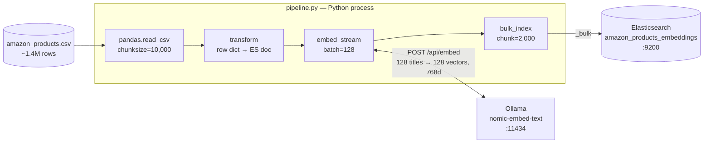
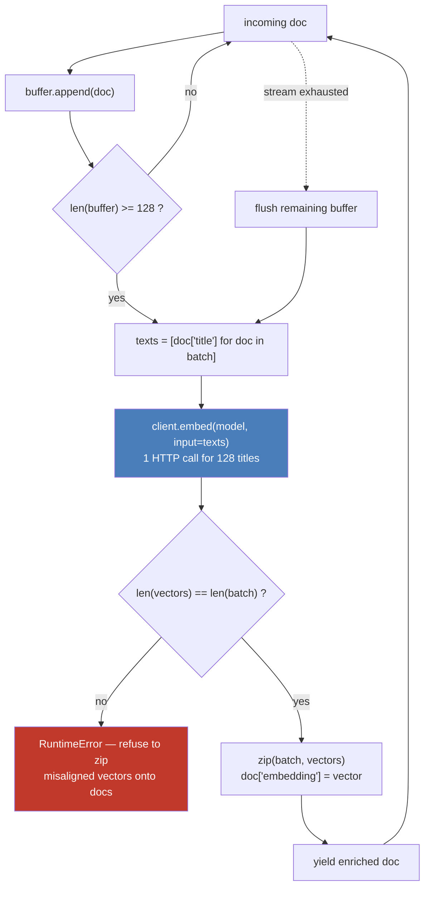

# Article 02 — Vector Ingestion

Enriches the article-01 pipeline with vector embeddings: same Kaggle **Amazon Products Dataset 2023**, same Elasticsearch instance, but each document gets a 768-dim `dense_vector` generated at ingestion time via [Ollama](https://ollama.com) running `nomic-embed-text`.

**Dataset:** [Amazon Products Dataset 2023 (1.4M products)](https://www.kaggle.com/datasets/asaniczka/amazon-products-dataset-2023-1-4m-products) — download `amazon_products.csv` and place it in `article-02-vector-ingestion/data/`.

**Target index:** `amazon_products_embeddings`

## Architecture

A single chain of Python generators — the 1.4M-row CSV never sits in memory. Each stage pulls from the previous one on demand, with embeddings computed client-side (no ES inference pipeline).



The embedding stage itself buffers, calls Ollama once per batch, and zips the returned vectors back onto the buffered documents:



Ollama's `/api/embed` returns vectors **in input order** — that guarantee is what makes the `zip` valid, and the cardinality check is the guardrail against silently attaching the wrong vector to the wrong product.

See [ARCHITECTURE.md](ARCHITECTURE.md) for the full picture: configuration wiring, run lifecycle, resulting document shape, and known limits.

## Run

From the repo root, with the docker stack up (`make up`):

```bash
# Dry run (transform + embed, no indexing) — validates Ollama connectivity
python article-02-vector-ingestion/pipeline.py --dry-run --limit 1000

# Limited ingestion (recommended for the article — 100k docs)
python article-02-vector-ingestion/pipeline.py --limit 100000

# Full ingestion (1.4M docs — long, GPU strongly recommended)
python article-02-vector-ingestion/pipeline.py

# Tune embedding batch size (default: 128)
python article-02-vector-ingestion/pipeline.py --limit 100000 --embed-batch 256

# Rebuild from scratch into a fresh versioned index, then swap the alias
python article-02-vector-ingestion/pipeline.py --limit 100000 --recreate
```

Or through the Makefile, from the repo root:

```bash
make dry-run                     # 1000 docs, transform + embed, no indexing
make ingest                      # full 1.4M dataset into a fresh versioned index
make ingest LIMIT=100000         # subset
make ingest EMBED_BATCH=256      # larger Ollama batches
make ingest INCREMENTAL=1        # rewrite the live index instead of building a new one
```

`make ingest` defaults to `--recreate` and to the **full** dataset — `LIMIT` is the opt-in.

## Index versioning

Documents are keyed by ASIN (`_id`), so a normal run **overwrites in place** rather than
appending — re-running never duplicates, it refreshes.

`--recreate` builds a new `amazon_products_embeddings_v<n>` instead, leaving the index
currently in service untouched and queryable for the whole run. Only once the new index is
complete, refreshed and merged does the alias move onto it, in a single atomic call:

```bash
curl -s 'localhost:9200/_cat/aliases/products_embeddings?v'   # which index is live
curl -s 'localhost:9200/products_embeddings/_count'           # always query the alias
```

The previous index is kept on disk — the run logs the exact call to roll back onto it, or to
delete it once you're satisfied. Query `products_embeddings`, never a versioned name.

## Structure

```
article-02-vector-ingestion/
├── data/                                       # gitignored — put amazon_products.csv here
├── mappings/
│   └── amazon_products_embeddings_v1.json      # ES mapping with dense_vector(768, cosine)
├── transforms/
│   └── product.py                              # CSV row → ES document (skips rows with no title)
├── embeddings/
│   └── ollama.py                               # Buffered batch-embed helper
└── pipeline.py                                 # main entry point
```

## What the pipeline does

1. Creates the index from `mappings/amazon_products_embeddings_v1.json` (skips if exists)
2. Optimizes index settings for bulk import (`refresh_interval: -1`, `replicas: 0`)
3. Reads the CSV in chunks of 10 000 rows with pandas
4. Transforms each row, skipping rows with no ASIN or no title
5. Buffers documents into batches of 128, sends titles to Ollama `/api/embed`, attaches the returned vectors as `embedding`
6. Bulk-indexes with `chunk_size=2000` via `streaming_bulk`
7. Restores settings (`refresh_interval: 1s`, `replicas: 1`) and refreshes
8. Force merges to 1 segment per shard
9. Points the `products_embeddings` alias at the index it just wrote

## Embedding choices

- **Model:** `nomic-embed-text` — 768 dims, open-weights, runs on CPU or GPU via Ollama.
- **Field:** `title` only. Short, descriptive, and the field most users would search semantically.
- **Similarity:** `cosine` — the default for normalized text embeddings.
- **Index type:** ES 9.x default for `dense_vector` with `index: true` — HNSW with `int8_hnsw` quantization (4× memory reduction with negligible recall loss).

## Performance notes

The embedding stage is the bottleneck — one Ollama call per document on 1.4M items would be hours. Two mitigations:

- **Batching.** Ollama's `/api/embed` accepts an `input` array; we send 128 titles per call by default. Tune with `--embed-batch`.
- **Subset.** For the article we ingest 100k docs (`--limit 100000`); enough to demonstrate hybrid search downstream without an overnight run.

GPU is strongly recommended — `ollama` in `docker/docker-compose.yml` is configured to pass through NVIDIA devices via the Container Toolkit.
