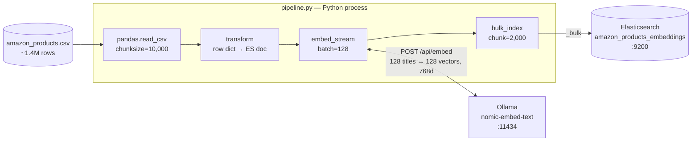
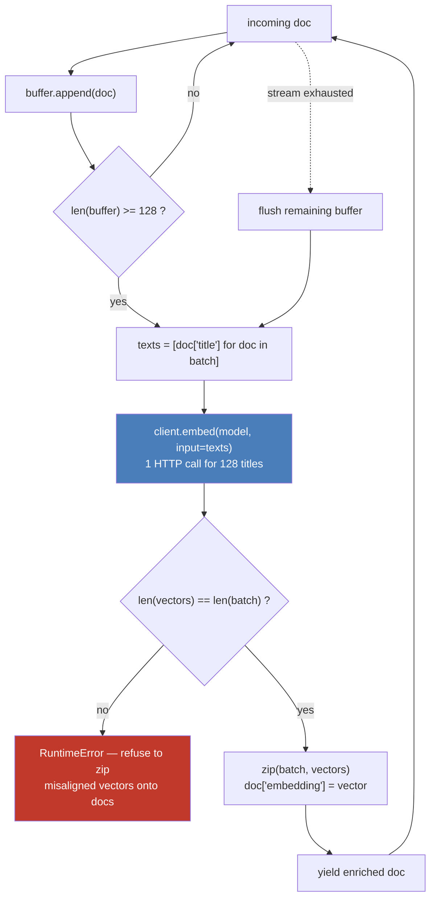

# Article 02 — Vector Ingestion

Enriches the article-01 pipeline with vector embeddings: same Kaggle **Amazon Products Dataset 2023**, same Elasticsearch instance, but each document gets a 768-dim `dense_vector` generated at ingestion time via [Ollama](https://ollama.com) running `nomic-embed-text`.

**Dataset:** [Amazon Products Dataset 2023 (1.4M products)](https://www.kaggle.com/datasets/asaniczka/amazon-products-dataset-2023-1-4m-products) — download `amazon_products.csv` and place it in `article-02-vector-ingestion/data/`.

**Target index:** `amazon_products_embeddings`

## Architecture

A single chain of Python generators — the 1.4M-row CSV never sits in memory. Each stage pulls from the previous one on demand, with embeddings computed client-side (no ES inference pipeline).



The embedding stage itself buffers, calls Ollama once per batch, and zips the returned vectors back onto the buffered documents:



Ollama's `/api/embed` returns vectors **in input order** — that guarantee is what makes the `zip` valid, and the cardinality check is the guardrail against silently attaching the wrong vector to the wrong product.

See [ARCHITECTURE.md](ARCHITECTURE.md) for the full picture: configuration wiring, run lifecycle, resulting document shape, and known limits.

## Run

From the repo root, with the docker stack up (`make up`):

```bash
# Dry run (transform + embed, no indexing) — validates Ollama connectivity
python article-02-vector-ingestion/pipeline.py --dry-run --limit 1000

# Limited ingestion (recommended for the article — 100k docs)
python article-02-vector-ingestion/pipeline.py --limit 100000

# Full ingestion (1.4M docs — long, GPU strongly recommended)
python article-02-vector-ingestion/pipeline.py

# Tune embedding batch size (default: 128)
python article-02-vector-ingestion/pipeline.py --limit 100000 --embed-batch 256

# Rebuild from scratch into a fresh versioned index, then swap the alias
python article-02-vector-ingestion/pipeline.py --limit 100000 --recreate
```

Or through the Makefile, from the repo root:

```bash
make dry-run                     # 1000 docs, transform + embed, no indexing
make ingest                      # full 1.4M dataset into a fresh versioned index
make ingest LIMIT=100000         # subset
make ingest EMBED_BATCH=256      # larger Ollama batches
make ingest INCREMENTAL=1        # rewrite the live index instead of building a new one
```

`make ingest` defaults to `--recreate` and to the **full** dataset — `LIMIT` is the opt-in.

## Index versioning

Documents are keyed by ASIN (`_id`), so a normal run **overwrites in place** rather than
appending — re-running never duplicates, it refreshes.

`--recreate` builds a new `amazon_products_embeddings_v<n>_<YYYYMMDD-HHMM>` instead (UTC
timestamp, so sorting index names by name sorts them chronologically), leaving the index
currently in service untouched and queryable for the whole run. Only once the new index is
complete, refreshed and merged does the alias move onto it, in a single atomic call:

```bash
curl -s 'localhost:9200/_cat/aliases/products_embeddings?v'   # which index is live
curl -s 'localhost:9200/products_embeddings/_count'           # always query the alias

# every build, oldest first
curl -s 'localhost:9200/_cat/indices/amazon_products_embeddings*?v&s=index&h=index,docs.count,store.size'
```

The previous index is kept on disk — the run logs the exact call to roll back onto it, or to
delete it once you're satisfied. Query `products_embeddings`, never a versioned name.

## Verifying an index

The pipeline now runs these checks itself before moving the alias — see [the gate](#the-gate).
What follows is how to run them by hand against an index that already exists.

A run that died midway leaves an index that *looks* populated, and `docs.count` alone will
not tell you. Three checks, cheapest first.

**Coverage** — every document must carry a vector, so the two counts have to match:

```bash
IDX=localhost:9200/amazon_products_embeddings

curl -s "$IDX/_count"
curl -s "$IDX/_count" -H 'Content-Type: application/json' \
  -d '{"query":{"exists":{"field":"embedding"}}}'
```

The expected total is the number of CSV rows *minus* the rows `transform` drops for having
no ASIN or no title. Beware that pandas reads `NULL`, `NA`, `None` and friends as `NaN`, so a
product whose title is literally the string `NULL` is dropped — the full dataset yields
1 426 336 documents out of 1 426 337 rows for exactly that reason.

A high `docs.deleted` is **not** a defect: `_id` is the ASIN, so re-running overwrites in
place and leaves tombstones behind. The force merge at the end of a run reclaims them.

**Authenticity** — presence is not correctness. Re-embed a stored title and compare it to
the stored vector; cosine comes back at 1.0 to within float noise:

```python
stored = doc["_source"]["embedding"]
recomputed = client.embed(model="nomic-embed-text", input=[doc["_source"]["title"]])["embeddings"][0]
cosine(stored, recomputed)   # → 0.99999…   anything lower: not this model's vectors
```

This is what distinguishes a real embedding from a well-formed 768-float array, and it is
worth running on a few documents from each ingestion batch before trusting an index.

**End to end** — a kNN query in natural language is the smoke test. `"wireless bluetooth
headphones for running"` should return running earbuds at the top, not arbitrary products.

## Structure

```
article-02-vector-ingestion/
├── data/                                       # gitignored — put amazon_products.csv here
├── mappings/
│   └── amazon_products_embeddings_v1.json      # ES mapping with dense_vector(768, cosine)
├── transforms/
│   └── product.py                              # CSV row → ES document (skips rows with no title)
├── embeddings/
│   └── ollama.py                               # Buffered batch-embed helper
└── pipeline.py                                 # main entry point
```

## What the pipeline does

1. Creates the index from `mappings/amazon_products_embeddings_v1.json` (skips if exists)
2. Optimizes index settings for bulk import (`refresh_interval: -1`, `replicas: 0`)
3. Reads the CSV in chunks of 10 000 rows with pandas
4. Transforms each row, skipping rows with no ASIN or no title
5. Buffers documents into batches of 128, sends titles to Ollama `/api/embed`, attaches the returned vectors as `embedding`
6. Bulk-indexes with `chunk_size=2000` via `streaming_bulk`
7. Restores settings (`refresh_interval: 1s`, `replicas: ES_REPLICAS`) and refreshes
8. Measures recall against an exact scan — **and refuses to publish a build that fails**
9. Points the `products_embeddings` alias at the index it just wrote

There is deliberately no force merge — see [Recall](#recall--is-the-index-actually-searchable).

## Embedding choices

- **Model:** `nomic-embed-text` — 768 dims, open-weights, runs on CPU or GPU via Ollama.
- **Field:** `title` only. Short, descriptive, and the field most users would search semantically.
- **Similarity:** `cosine` — the default for normalized text embeddings.
- **Index type:** `int8_hnsw` with `m: 32`, `ef_construction: 200`. ES 9 would default to `m: 16, ef_construction: 100`, which measurably under-serves 1.4M vectors — the explicit values are worth their indexing cost, see below.

## Recall — is the index actually searchable?

Counting documents proves nothing about search. An index can hold every document, each with a valid 768-float unit vector, and still fail to return them: the kNN query walks an HNSW graph, and how well that graph was built is invisible to `docs.count`. So the pipeline measures it, and the numbers below are what the settings are chosen from.

### Measuring it honestly

Recall is measured against an exact brute-force scan of the same index. The subtlety is **which queries** you probe with. Hand-written text queries are a trap here: on this dataset, a query like `"wireless bluetooth headphones for running"` has its ranks 2–10 sitting within 0.04 cosine of each other, so thousands of the 1.4M documents are effectively tied. Recall@10 then measures which of the near-ties the ANN happened to pick, not whether it works — and it swings wildly for reasons that have nothing to do with the index.

The fix is to probe with **the embedding of a document drawn from the index**. That document is its own nearest neighbour, so the neighbourhood is real and well separated. This is what `shared/es/verify.py` does, and what the table below uses.

### What actually moves the needle

100 000 documents sampled across the whole CSV (every 14th row — the file is ordered by category, so a head slice covers 15 categories instead of 246). Recall@10 over 30 probes, against exact search:

| index_options | force merge | segments | ef=100 | ef=100 +oversample 4 | ef=500 +oversample 4 |
|---|---|---|---|---|---|
| ES 9 defaults | no | 4 | 85 % | 92 % | 95 % |
| ES 9 defaults | to 1/shard | 2 | 82 % | 87 % | 93 % |
| **m=32, ef_c=200** | **no** | 4 | **92 %** | **100 %** | **100 %** |
| m=32, ef_c=200 | to 1/shard | 2 | 87 % | 97 % | 100 % |

Three findings, in order of value:

- **`rescore_vector` costs nothing and buys the most.** Oversampling retrieves extra candidates on the quantized vectors then rescores them at full precision. It is a *query-time* option — no rebuild, no reindex — and it is worth +7 to +8 points:
  ```json
  { "knn": { "field": "embedding", "query_vector": [...], "k": 10,
             "num_candidates": 500, "rescore_vector": { "oversample": 4 } } }
  ```
- **Raising `m` and `ef_construction` is worth ~7 points** for about 16 % more indexing time. Hence the explicit `index_options` in the mapping.
- **Force merging to one segment costs ~5 points.** Each segment carries its own HNSW graph and Elasticsearch searches every one of them with the full `num_candidates` budget, so collapsing to a single segment shrinks the exploration a query gets. It also costs 25 s and buys nothing this index needs, so `VECTOR_MAX_SEGMENTS` in `pipeline.py` is `None`. If you ever re-enable it, target several segments per shard — never 1.

### The gate

`verify_vector_index` runs after the build and before the alias moves. It checks coverage, then probes recall, and a build that falls under the floor **does not get published**: the alias keeps serving the previous index and the run exits non-zero. Roughly 35 s per probe on 1.4M documents, five probes by default.

The floor is set at 40 %, deliberately a bar for *broken* rather than a target for *good*. Repeated runs against the 1.4M index land anywhere between 63 % and 90 % depending on which documents get drawn — five probes is a coarse instrument, and that spread is the reason the floor sits well below the observed range. Treat a passing gate as "the graph retrieves", never as "the recall is tuned"; use the table above for that.

## Performance notes

The embedding stage is the bottleneck — one Ollama call per document over 1.4M items would run for hours. Two levers matter, and they are not worth the same.

### Where Ollama runs, and how big the batches are

Measured on an RTX 5060 Ti (16 GB) with `--dry-run`, so the numbers isolate transform + embed with no bulk indexing in the way:

| Setup | Throughput | Extrapolated to 1.4M |
|-------|-----------|----------------------|
| CPU only | 87 docs/s | ~4 h 30 |
| GPU, `--embed-batch 128` (default) | 321 docs/s | ~74 min |
| **GPU, `--embed-batch 512`** | **504 docs/s** | **~47 min** |
| GPU, `--embed-batch 1024` | 507 docs/s | plateau |
| GPU, `--embed-batch 2048` | 505 docs/s | plateau |

Moving Ollama onto the GPU buys ~3.7×; raising the batch on top of that buys another ~1.6×. Both are cheap — neither touches the pipeline code:

```bash
make ingest EMBED_BATCH=512
```

Getting the GPU is the part that fails quietly: a CPU-only run produces exactly the same index, just hours later. See [GPU acceleration](../README.md#gpu-acceleration) for how the stack enables it and, more importantly, how to verify it actually happened.

### Why it stops at ~500 docs/s

Throughput plateaus from batch 512 onward while the GPU sits at **51 % average utilization** (59 % peak). The model is small — 261 MiB of weights — so there is nothing left to saturate by enlarging batches further.

The idle half is structural, not a tuning problem: the pipeline is a single thread doing read → transform → HTTP → bulk in sequence, so the GPU waits while pandas parses CSV and while Elasticsearch takes the bulk. Closing that gap needs the stages to overlap, not bigger batches — see [Known limits](ARCHITECTURE.md#6-known-limits).

### Subset

For the article, 100k docs (`make ingest LIMIT=100000`) is enough to demonstrate hybrid search downstream without committing to a full run.
